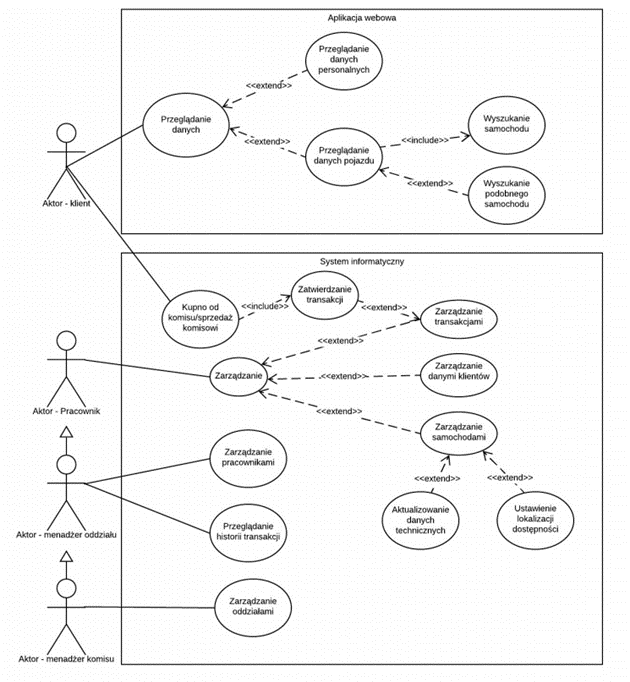
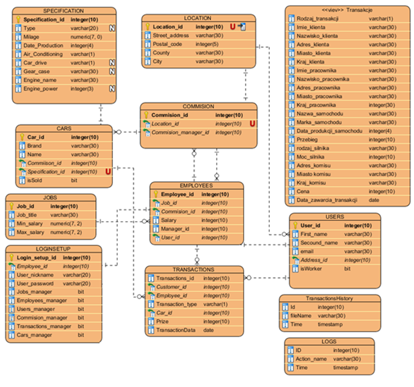

# usedCarDealer-s-System
System enabling remote management of the used car dealers network 

## Enable project
Run carAdminSystem.exe

## Caution
It's only preview version so you are not able to delete anything, create new user, do a transaction or do sqlInjuction / ddos atack. 
Long time data load may be caused low azure server which was enabled to preview.

---
## Project description [PL]

### Wstęp
Baza danych jest bazą rozproszonej sieci komisów samochodowych. Zapewnia nie tylko obsługę niezbędnych funkcji realizowanych przez konkretny komis, ale również na przechowywanie informacji o samochodach, klientach, pracownikach, a także realizacją procesu transakcyjnego między klientami a komisem. 
 
Głównymi funkcjonalnościami są:  
● Zakup pojazdu przez komis  
● Przeglądanie samochodów w aplikacji webowej  

Każda zmiana wprowadzona do systemu jest zapisywana do historii, która daje możliwość prowadzenia analizy historii transakcji. 

## Opis aktorów w projekcie

W projekcie wyróżniamy kilku aktorów:

Pracownik : jest odpowiedzialny za utrzymanie aktualnej bazy pojazdów i przeprowadzania transakcji. W zależności od przyznanych mu uprawnień ma możliwość:\
•	Dodawania, usuwania, edycji danych pojazdów\
•	Sprzedaży pojazdu o Edycji swoich danych personalnych\
•	Sprawdzenia komu podlega o Wglądu w historię transakcji każdego klienta jeśli klient poda mu kod transakcji\
•	Skup pojazdów od klientów\
•	Dodawania/usuwania danych klienta\
•	Zmiany danych personalnych\
•	Udostępnieniu historii transakcji\
•	Przeglądanie najczęściej kupowanych modeli\

Manager oddziału : Jest to osoba zarządzająca pojedynczym oddziałem komisu. Ma uprawnienia do wszystkich funkcjonalności pracownika, a także:\
•	Zatrudniania i zwalniania pracowników ( tylko swojego oddziału  )\
•	Ustalania wypłat i stanowisk pracowników ( tylko swojego oddziału  )\
•	Przeglądania zysków/strat komisu\
•	Przeglądanie najskuteczniejszych pracowników\
•	Przeglądanie pracowników podlegających pod managera\

 Manager komisu - osoba upoważniona do wglądu do wszystkich tabel i funkcjonalności. Domyślnie podczas tworzenia bazy utworzone zostanie również konto Managera komisu. Posiada wszystkie funkcjonalności managera oddziału, ale w odróżnieniu od managera oddziału sam sobie jest managerem. 
   
Klient : jest osobą zainteresowaną kupnem samochodu poszukującą konkretnego modelu dostępnego w bazie. Ma uprawnienia do:\
•	Przeglądania bazy pojazdów\
•	Filtrowania bazy pojazdów po dowolnych\
•	Sprawdzenia lokalizacji komisu w którym znajduje się wybrany przez niego pojazd\

### Diagram encji

### Identyfikacja transakcji

Dodanie nowego samochodu do tabeli CAR wymusza przypisanie istniejącego rekordu ze specyfikacją z tabeli SPECIFICATION lub utworzenie nowego rekordu. 
W przypadku utworzenia nowego komisu wymagane jest również podanie rekordu z tabeli LOCATION. W przypadku braku odpowiedniego rekordu należy go dodać do tabeli.
Dodanie użytkownika do tabeli USERS wymaga podania informacji do tabeli LOCATION odnośnie adresu zamieszkania. Należy również określić czy użytkownik jest pracownikiem czy klientem. Jeśli atrybut isWorker = 1, oznacza, że użytkownik jest pracownikiem i należy przypisać mu odpowiednio stanowisko (utworzyć, jeśli nie ma odpowiedniego), komis, managera oraz pensję.

W celu utworzenia transakcji musi zostać wybrany z bazy pracownik, klient oraz samochód. Obowiązkowo należy również podać cenę oraz rodzaj transakcji (kupno/sprzedaż -względem komisu). W przypadku braku odpowiednich rekordów należy dodać je do bazy. Wygenerowanie rekordu transakcji wiąże się z dodaniem nowego rekordu do tabeli TransactionHistory (zawierającego odpowiednie atrybuty z widoku Transakcje).
Każda dokonana zmiana zostaje zapisana w tabeli LOG.
Utworzenie pliku powstałego z widoku generuje automatyczny wpis do tabeli TransactionHistory.

### Sposób zapewniania spójności dla encji powiązanych

W przypadku próby usunięcia encji która pod sobą ma jeszcze inne encje program(baza) powinna poinformować, że nastąpiła próba usunięcia encji powiązanej i zapytać się czy użytkownik chce usunąć także i powiązaną encję. Wybranie twierdzącej odpowiedzi usunie odpowiednio kolejno encje od których pobierany jest klucz główny.
Usunięcie rekordu z tabeli LOCATION jest bezpośrednio niedostępną operacją.

Próba usunięcia adresu należącego do komisu zostanie wywołane zapytanie autoryzacji. Opcja dostępna tylko dla managera komisu. Usunięcie lokacji komisu wymaga wcześniejszego usunięcia wszystkich pracowników danego komisu oraz samochodów wraz z odpowiednimi specyfikacjami. 
W przypadku próby usunięcia adresu użytkownika zostanie wywołane zapytanie autoryzacji dostępne dla pracownika o odpowiednim statusie. Jeśli dla przynajmniej jednego użytkownika atrybut isWorker = true przed usunięciem rekordów w tabeli USERS należy również usunąć odpowiednie rekordy z tabeli EMPLOYEES. 

Przed usunięciem rekordu komisu należy usunąć rekordy pracowników z tabeli USERS oraz EMPLOYEES wraz z ich adresami w tabeli LOCATIONS, oraz odpowiednie samochody z tabeli CAR.
Usunięcie specyfikacji pojazdu z tabeli SPECIFICATION wymaga usunięcia samochodów z tabeli CAR.
Stanowisko można usunąć tylko wtedy kiedy nie jest przyporządkowane żadnej osobie.
Usunięcie pojazdu wymaga wcześniejszego usunięcia odpowiednich transakcji. 

### Opis implementacji bazy danych i serwera
#### Tabele

W środowisku Microsoft SQL Server Management Studio 18 została utworzona baza zgodnie z diagramem encji przedstawionym w części opisanej tą samą nazwą. Każda kolumna otrzymała typ zadeklarowany na diagramie. Podczas deklaracji każdej tabeli na odpowiednią kolumnę został dodany constraint primary key, czyli klucz główny.
Klucze obce zostały przypisane do odpowiedniej kolumny dopiero po utworzeniu wszystkich tabel.  
Ponieważ klucz główny z definicji jest unikalny dla każdego rekordu w danej tabeli, w przypadku dodania nowego rekordu aby uprościć wyliczenie odpowiedniego id został dodany constraint identity(1,1). Dzięki niemu w przypadku ingerencji w zawartość tabeli nie ma konieczności deklaracji każdorazowo nowego id. Jest on automatycznie liczony począwszy od nr 1 co 1.  
Niektóre kolumny przyjmują tylko określone wartości z przedziału. W tabeli SPECIFICATION która określa specyfikacje konkretnego samochodu możemy dodać rocznik auta. W celu uniknięcia pomyłek i zapewnieniu jak najbardziej stabilnego i niezawodnego systemu został dodany constraint check (Date_production between 1950 and 2020). Ogranicza on wartość rocznika samochodu od roku (wartości) 1950 do 2020.
Niektóre rekordy w kolumnach powinny mieć indywidualne unikalne wartości. Taki sposób zapisu danych gwarantuje użyty przez nas constraint unique na konkretną kolumnę w tabeli.
Dodanie constraint’a not null gwarantuje brak niezidentyfikowanych rekordów, a co za tym idzie gwarantuje relację zero lub wiele. 
Widok
Oprócz tabel został zrealizowany także kod tworzący widok transakcji. Dzięki niemu mamy wgląd do wszelkich informacji na temat samochodu, klienta oraz sporządzającego umowę. Docelowo widok mógłby służyć do automatycznego generowania dokumentu sprzedaży/zakupu.\

#### Wyzwalacze (triggery)

Oprócz tabel i widoku zostały dodane również wyzwalacze (triggery). Pozwalają one na wywołanie zawartej w niej instrukcji po spełnieniu odpowiedniego przypadku. W naszym projekcie każda ingerencja w daną tabelę (dodanie, edycja, usunięcie rekordu) powodowała dopisanie informacji o zmianie do tabeli logów. 
W przypadku dodania transakcji oprócz informacji w tabeli logów generowana zostawała także odpowiednia informacja do tabeli transakcji.
Ze względu na fakt iż założenia projektowe sprowadzały się do realizacji 6 działań w programie utworzono 6 trigger’ów co w przypadku pracy dla większej ilości osób może powodować przeładowanie bazy (wystąpienie wąskiego gardła). Niestety nie istnieje bezpośredni sposób na rozwiązanie wskazanego problemu.\

#### Procedury transakcyjne
Korzystanie z aplikacji desktopowej sprowadza się do przeglądania, dodawania, aktualizowania, usuwania rekordów. Ze względu na dużą ilość parametrów użytych w poszczególnych transakcjach aby ułatwić wywoływanie zapytań w aplikacji, w pewnym stopniu aby zabezpieczyć przed niepożądanymi operacjami i atakami zdecydowaliśmy się na użycie procedur. 
Baza przechowuje 24 podstawowe procedury oraz dodatkowe pomocnicze.

Podstawowe procedury:\
Wyświetlanie informacji o: komisach, pracownikach, klientach, samochodach, stanowiskach, transakcjach\
Dodawanie: komisów, pracowników, klientów, samochodów, stanowisk, transakcji.\
Aktualizowanie: komisów, pracowników, klientów, samochodów, stanowisk, transakcji.\
Usuwanie: komisów, pracowników, klientów, samochodów, stanowisk, transakcji.\

Szczegółowe omówienie kolejności kaskadowej edycji danych względem zarządzania:

Komisami - tabele:  LOCATION -> COMMISIONS\
Pracownikami – tabele: LOCATION -> USERS -> EMPLOYEES -> LOGINSETUP\
Klientami – tabele: LOCATION -> USERS\
Samochodami – tabele: SPECIFICATION -> CARS\
Stanowiskami – tabele: JOBS\
Transakcjami – tabele: SPECIFICATION -> CARS -> LOCATIONS -> USERS -> TRANSACTIONS\

#### Pomocnicze procedury m.in.: 
Wyświetlanie wszystkich samochodów dla zadanych danych\
Wydrukowanie aktualnego zalogowanego pracownika\
Wyszukanie danych managera odpowiedniego komisu\
Wyświetlenie danych dla konkretnego id\

